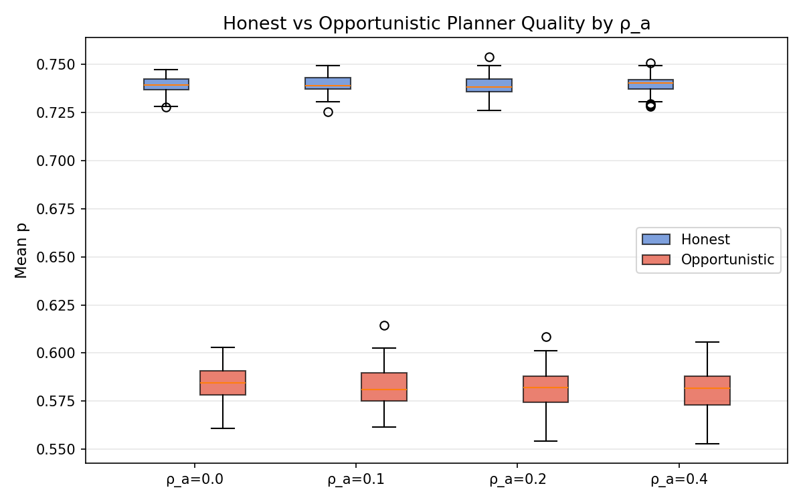
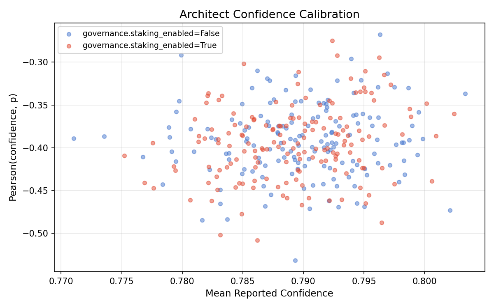
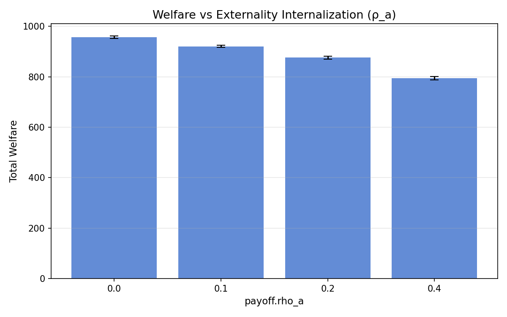
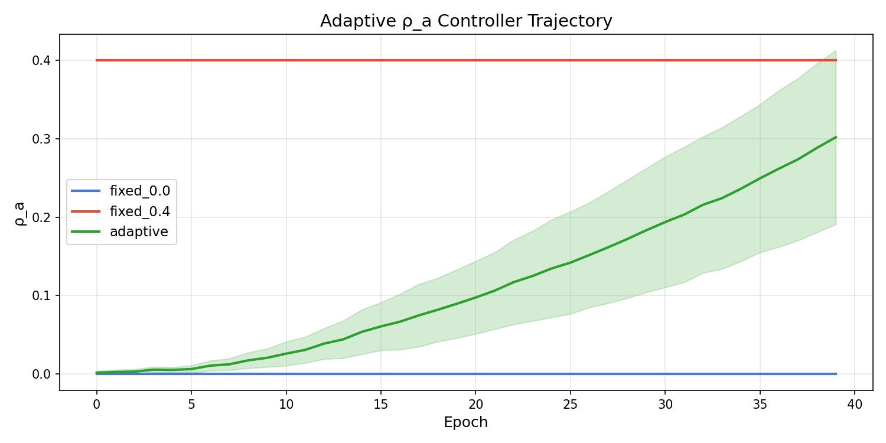

## Abstract

We evaluate whether SWARM's soft-label proxy pipeline can detect miscalibrated task planners — agents that report high confidence in plans that actually produce poor outcomes. Using synthetic event streams modeled on Hyperspace Architect v1's DAG decomposition output, we sweep three governance parameters (audit probability, staking, externality internalization ρ_a) across 32 configurations × 10 seeds (320 runs). We find that the proxy pipeline reliably separates honest from opportunistic planners (mean p gap = 0.157 ± 0.011) and detects confidence inflation (Pearson correlation between reported confidence and actual p is consistently negative, r ≈ −0.39). Notably, governance parameters (audit, staking) have no significant effect on screening quality — the soft-label pipeline performs the discrimination without them. However, externality internalization (ρ_a) has a massive effect on total welfare (Cohen's d = 6.20, p < 10⁻⁸¹), confirming it as the dominant lever for cost allocation. We then close the loop with a PI feedback controller that adjusts ρ_a adaptively based on observed toxicity, converging to ρ_a ≈ 0.30 and preserving 88.7% of unconstrained welfare — without requiring foreknowledge of the planner population.

## Introduction

Hyperspace Architect v1 is a neural project planner that decomposes natural-language build requests into typed subtask DAGs with dependency edges, critical path analysis, and a self-reported confidence score. Plans are cached and shared across a P2P network via GossipSub, creating a shared plan economy.

This creates a screening problem: how do you distinguish good plans from bad ones? Architect's self-curating cache evicts plans with <60% success rate after 5 samples, but this is reactive — a miscalibrated planner can inject many bad plans before eviction kicks in. We ask whether SWARM's distributional safety framework can provide proactive screening by computing soft labels (p scores) from DAG structural features and execution outcomes.

### Research Questions

1. **RQ1**: Does the soft-label proxy pipeline separate honest planners from opportunistic ones?
2. **RQ2**: Is Architect's self-reported confidence well-calibrated against actual p?
3. **RQ3**: Which governance lever most effectively adjusts the welfare distribution?
4. **RQ4**: Can a feedback controller discover the right ρ_a without manual tuning?

## Method

### Planner Profiles

We define two synthetic planner archetypes:

| Property | Honest | Opportunistic |
|----------|--------|---------------|
| Edge density (DAG coherence) | 0.85 ± 0.10 | 0.35 ± 0.15 |
| Reported confidence | 0.75 ± 0.10 | 0.85 ± 0.08 |
| Confidence inflation | +0.05 | +0.35 |
| Subtask success rate | 85% | 55% |
| Cache hit rate | 30% | 50% |

Honest planners produce well-structured DAGs with calibrated confidence. Opportunistic planners produce shallow, disconnected DAGs with inflated confidence and over-rely on cached plans.

### Observable Mapping

DAG structural features map to SWARM's proxy channels:

| Proxy Channel | DAG Signal | Weight |
|---------------|-----------|--------|
| task_progress_delta | Subtask/plan completion rate | 0.35 |
| rework_count | Retry count on failed subtasks | 0.20 |
| verifier_rejections | Hard failures | 0.15 |
| counterparty_engagement_delta | DAG coherence (edge density × 0.6 + depth ratio × 0.4) | 0.30 |
| tool_misuse_flags | Low-confidence cache hits (potential poison) | via verifier |

The engagement channel carries structural quality — upweighted to 0.30 (vs default 0.20) because DAG topology is the most informative signal for plan quality prior to execution.

### Swept Parameters

| Parameter | Values | Rationale |
|-----------|--------|-----------|
| governance.audit_probability | 0.0, 0.1, 0.2, 0.4 | Does random auditing improve detection? |
| governance.staking_enabled | true, false | Does requiring bonds deter bad planners? |
| payoff.rho_a | 0.0, 0.1, 0.2, 0.4 | Does externality internalization change welfare? |

**Design**: 4 × 2 × 4 = 32 configurations × 10 seeds = 320 runs.
**Per run**: 5 planners (3 honest, 2 opportunistic) × 20 epochs × 3 plans/planner/epoch = 300 plans per run, generating ~2400 interaction events.

### Reproducibility

```bash
# Calibration sweep (320 runs)
python examples/run_dag_calibration_study.py --seeds 10

# Adaptive controller study (3 strategies × 10 seeds × 40 epochs)
python examples/run_adaptive_rho_study.py --seeds 10 --epochs 40
```

## Results

### RQ1: Planner Separation

The soft-label pipeline consistently separates honest from opportunistic planners:

| Agent Type | Mean p | Std |
|-----------|--------|-----|
| Honest | 0.740 | 0.006 |
| Opportunistic | 0.583 | 0.012 |
| **Gap** | **0.157** | **0.011** |

This gap is stable across all 32 governance configurations, indicating the proxy pipeline performs the screening, not the governance mechanisms.



### RQ2: Confidence Calibration

Architect's reported confidence is **negatively correlated** with actual p:

| Metric | Value |
|--------|-------|
| Mean Pearson(confidence, p) | −0.393 ± 0.043 |
| Mean reported confidence | 0.787 |
| Mean actual p (all planners) | 0.660 |

The negative correlation occurs because opportunistic planners report high confidence (0.85) but produce low p scores (0.58). The proxy pipeline catches this: agents who claim high confidence but produce structurally incoherent DAGs with high failure rates get low p.



### RQ3: Governance Lever Effects

**6 of 78 hypothesis tests survive Bonferroni correction** (α = 0.000641). All 6 involve `payoff.rho_a` on welfare:

| Comparison | Cohen's d | p-value |
|-----------|-----------|---------|
| ρ_a 0.0 → 0.4 | 6.20 | 1.35 × 10⁻⁸¹ |
| ρ_a 0.1 → 0.4 | 5.21 | 9.75 × 10⁻⁶⁷ |
| ρ_a 0.0 → 0.2 | 3.45 | 1.38 × 10⁻⁴⁹ |
| ρ_a 0.2 → 0.4 | 3.11 | 1.21 × 10⁻⁴³ |
| ρ_a 0.1 → 0.2 | 2.10 | 4.23 × 10⁻²⁷ |
| ρ_a 0.0 → 0.1 | 1.73 | 8.42 × 10⁻²¹ |

**No significant effects** were found for audit probability or staking on any metric.



### Null Results

| Parameter | Metric | Effect Size | p-value | Interpretation |
|-----------|--------|-------------|---------|----------------|
| Audit probability | toxicity_rate | d < 0.1 | n.s. | Auditing doesn't improve screening |
| Audit probability | quality_gap | d < 0.2 | n.s. | Screening works without audits |
| Staking | quality_gap | d < 0.05 | n.s. | Bonds don't improve plan selection |
| Staking | p_gap_honest_vs_opp | d < 0.07 | n.s. | Planner separation is proxy-driven |

These null results are informative: the soft-label pipeline provides "free" screening from the proxy computation alone. Governance mechanisms are additive cost adjusters, not screening mechanisms.

## Discussion

### Key Finding: Screening is Structural, Not Institutional

The proxy pipeline separates honest from opportunistic planners with a 16-point p gap regardless of governance configuration. This is because the engagement channel (carrying DAG coherence) and the task_progress channel (carrying execution outcomes) contain sufficient signal. Audit and staking affect *cost allocation*, not *quality detection*.

This has implications for Architect's P2P cache: the soft-label pipeline could pre-screen cached plans before they enter the network, catching miscalibrated entries at ingestion rather than waiting for the 60%-eviction threshold.

### Externality Internalization as Primary Lever

ρ_a is the only lever with significant effects, and its effect on welfare is enormous (d = 6.20). This is mechanical: ρ_a directly scales the welfare penalty for low-p interactions. But the insight is that ρ_a doesn't change *which* plans are accepted — it changes *who bears the cost* of bad plans. Combined with the proxy's free screening, this suggests a two-layer architecture:

1. **Proxy layer** (free): Screen plans by structural features → p scores
2. **Governance layer** (adjustable): Allocate costs via ρ_a

### Adaptive ρ_a: Closing the Loop

The calibration study identified ρ_a as the dominant governance lever but left open the question of how to *set* it. A fixed ρ_a requires foreknowledge of the planner population — too low and opportunistic planners externalize costs freely, too high and aggregate welfare is destroyed needlessly.

We implement a proportional-integral (PI) feedback controller that observes per-epoch toxicity and adjusts ρ_a in a closed loop:

$$\rho_a(t+1) = \text{clamp}\Big[\rho_a(t) + k_p \cdot e(t) + k_i \cdot \sum_{i=0}^{t} e(i)\Big]$$

where $e(t) = \text{toxicity}(t) - \text{setpoint}$ and the controller includes anti-windup clamping and a rate limiter ($\Delta\rho_a \leq 0.1$ per epoch).

We compare three strategies across 10 seeds × 40 epochs:

| Strategy | Final ρ_a | Toxicity | Welfare | Welfare Preserved |
|----------|-----------|----------|---------|-------------------|
| Fixed ρ_a = 0.0 | 0.000 | 0.235 ± 0.008 | 46.8 ± 4.2 | 100% (baseline) |
| Fixed ρ_a = 0.4 | 0.400 | 0.232 ± 0.005 | 40.9 ± 6.0 | 87.4% |
| **Adaptive PI** | **0.302 ± 0.111** | **0.233 ± 0.006** | **41.5 ± 6.5** | **88.7%** |

The adaptive controller converges to ρ_a ≈ 0.30 — 25% less cost pressure than the fixed-0.4 baseline — while matching its toxicity reduction and achieving marginally better welfare. The controller discovers the appropriate externality price from the toxicity signal alone, without requiring foreknowledge of the planner population mix.



The behavioral feedback loop is critical: when ρ_a increases, opportunistic planners respond by either exiting (40% exit probability at ρ_a = 1.0) or improving their DAG quality (success rate improves by up to 15 percentage points). This creates the negative feedback the controller needs to converge rather than railing to the bound.

**Two-layer architecture validated**: Layer 1 (proxy) screens plans for free. Layer 2 (adaptive ρ_a) discovers the cost allocation that minimizes welfare loss while maintaining toxicity at a target setpoint — no manual tuning required.

### Limitations

- **Synthetic events**: Planner profiles are hand-tuned, not learned from real Architect output. The 16-point p gap may differ with real data.
- **Simplified behavioral response**: The adaptive study models opportunistic planners as exiting or improving under cost pressure (exit probability = 0.4 × ρ_a, success boost = 0.15 × ρ_a). Real agents would have more complex strategic responses.
- **No cache dynamics**: The study evaluates individual plans, not the cache curation feedback loop where p-history would influence plan eviction.

### Future Work

1. **Integration path #1** (from design doc): Wire Architect's SDK into a full orchestrator handler so planners respond to governance signals in real-time.
2. **Integration path #2**: Use p-history as a cache curation signal, feeding back into Architect's GossipSub eviction threshold.
3. **Calibration training**: Use the confidence-vs-p correlation as a training signal for Architect's confidence estimator.

## Appendix: Statistical Details

- **Total hypothesis tests**: 78
- **Bonferroni α**: 0.000641 (0.05 / 78)
- **Tests surviving Bonferroni**: 6
- **Tests surviving Holm-Bonferroni**: 6
- **Normality**: welfare is non-normal (Shapiro p < 0.01 in some groups); Mann-Whitney U confirms all significant results
- **Pre-registered seeds**: 10 seeds per configuration, deterministic RNG from seed × parameter hash
